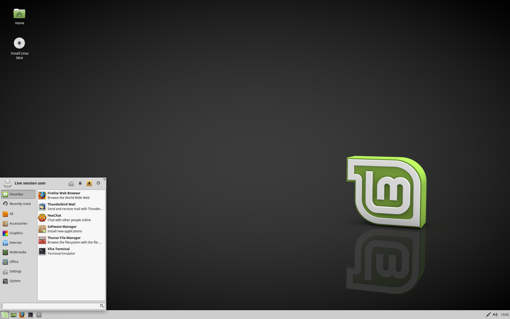

# Linux Mint

## It's History
Linux mint is a distribution based on Ubuntu (which in turn is based on Debian).

The linux mint project was strated by a software developer called Clément Lefèbvre (now known as Clem). Clem at the time was writing reviews and tuotorials for various linux websites and decided to start his own linux blog which he called "linux mint" (yes that where the naming came from).

While writing his content, Clem strated gainig an understanding of what the community wants from a distro and so he started the linux mint project in 2006 and its now one of the most popular distros out there. 

## Distro images
``-> Add distro images``

## It's Pros
- Works out of the box with full multimedia support (requires very little effort to setup).
- Very stable and low maintenance.
- It's based on Ubuntu which gives the user a large number of available packages (around 30,000).
- It's a very beginner friendly distro.
## It's Cons
``-> Add distro cons relating to: ``

``(Stability , Security , Performance , Compatible apps , Hardware/System requirements, Technical support of the distro's maintainers) and any other points you find``

## Who is it made for?
``-> Add distros targeted users``
## Who is it **not** made for?
This distro is not made for people who want bleeding edge performance out of their machine or people who are looking for a distro that allows them to have fine grain control over every single detail in order to fully costumize their operating system. 

People who fall in either or both of the above categories usually find other distros such as Arch linux more suitbale for their needs.

## What desktop environment does it use?
One of the nice things about linux mint is that it comes in three Editions each with a different desktop environments to suit different needs.

The editions are: Cinnamon, MATE and Xfce.

### Cinnamon
Cinnammon is a desktop envrionment developed by the linux mint team and is based on the GNOME 3 desktop environment.

cinnamon is the most modern and feature rich desktop envrionemnt and also the one that requires the most computing resources.

___cinnamon desktop___
### MATE
Another version of linux mint uses the MATE desktop environment which is also developed by the linux mint team and is based on the GNOME 2 desktop enviornment.

The mate version has a slower development and has less features than than the cinnamon edition;however, it is less resource intensive than cinnamon.

___MATE desktop___
### Xfce
The last version of linux uses the Xfce dektop environment

The Xfce version does not have as many features as in the cinnamon and MATE versions but it is extremely stabel and very light on resource usage makong it optimal for low spec machines.

___Xfce desktop___

## What package manager does it use?
``-> Add the package manager that it uses (apt, rpm, dpkg, etc)``
## User Experiences/Reviews
- I really love Linux Mint, it is easy to install, very easy to use - yet it also has all the power of Linux under its hood. Just open up a terminal and everything is there. A well thought out and well rounded desktop focused distribution with some really stunning aesthetics.
- Linux Mint is a great alternative for Windows or Ubuntu users, who are looking for a free and genuine operating system, that is both reliable and easy to operate.
- The main features of Linux Mint that made me choose it were: tools for graphic design (GIMP, Blender and Inkscape), improved productivity with LibreOffice suite and access to more than 7 thousand games with Steam.
## Fun facts
``-> Add some fun facts about the distro like (Famous people who use the distro and Distrowatch ranking) ``
## How to install it?
``-> Add instructions on methods of installing this distro``

